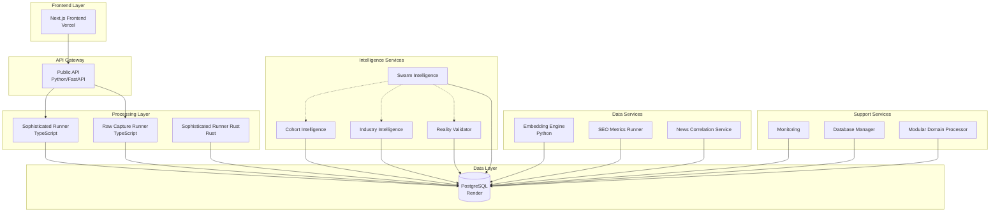

# Domain Runner Architecture Analysis Report

## Executive Summary

The Domain Runner is a complex microservices-based system designed for AI-powered brand intelligence and domain analysis. The system processes domains through multiple LLM providers to generate comprehensive business intelligence data.

## Architecture Overview

### Core Architecture Pattern
- **Type**: Microservices Architecture
- **Deployment**: Render.com Platform
- **Frontend**: Next.js (deployed on Vercel)
- **Backend**: Node.js/TypeScript services + Python services
- **Database**: PostgreSQL (Render managed)
- **Language Mix**: TypeScript (70%), Python (20%), Rust (10%)

## Service Architecture

### 1. Frontend Services
- **llm-pagerank-frontend**: Static site (moved to Vercel)
  - React/Next.js application
  - Authentication via Clerk
  - Payment processing via Stripe
  - Domain: llmrank.io

### 2. Core Processing Services

#### sophisticated-runner (TypeScript)
- **Purpose**: Main LLM processing orchestrator
- **Features**:
  - Tiered LLM processing (Fast/Medium/Slow tiers)
  - 8 LLM providers: OpenAI, Anthropic, DeepSeek, Together, XAI, Perplexity, Mistral, Google
  - Supports 30 concurrent workers
  - Batch processing (50-100 domains)
  - Key rotation for load balancing
- **Endpoints**:
  - `/process-pending-domains`
  - `/ultra-fast-process`
  - `/provider-usage`

#### raw-capture-runner (TypeScript)
- **Purpose**: Domain data capture and initial processing
- **Features**:
  - Domain management
  - Initial data collection
  - Integration with multiple LLM models
  - Dashboard interface

#### public-api (Python)
- **Purpose**: Public-facing API service
- **Features**:
  - Authentication and API key management
  - CORS-enabled endpoints
  - Rate limiting
  - Email notifications
- **Domain**: llmrank.io (primary)

### 3. Intelligence Services

#### industry-intelligence (TypeScript)
- Industry mapping and benchmarking
- JOLT benchmark analysis
- Industry-specific insights

#### cohort-intelligence (TypeScript)
- Cohort analysis and grouping
- Competitive intelligence
- Pattern recognition

#### reality-validator (TypeScript)
- Data validation
- Business/financial/market data sources
- Reality checking for AI responses

#### swarm-intelligence (TypeScript)
- Multi-agent coordination
- CohortAgent, InsightAgent, LiveRecoveryAgent
- Distributed processing orchestration

### 4. Data Services

#### embedding-engine (Python)
- Vector embeddings generation
- Similarity analysis
- Drift detection
- Cache management
- Time series analysis

#### seo-metrics-runner (TypeScript)
- SEO data collection
- Metrics tracking
- Performance monitoring

#### news-correlation-service (TypeScript)
- News scanning
- Tesla JOLT monitoring
- Correlation analysis

### 5. Support Services

#### monitoring (JavaScript)
- System health monitoring
- Data sanity checks
- Performance tracking

#### database-manager (TypeScript)
- Database operations
- Schema management
- Migration handling

#### modular-domain-processor (TypeScript)
- Modular domain processing
- Specialized processing workflows

### 6. Experimental Services

#### sophisticated-runner-rust (Rust)
- High-performance processing
- Tensor mathematics
- Security-focused implementation
- AI provider integrations

## Database Architecture

### Core Tables
1. **domains**: Domain registry and status tracking
2. **raw_responses**: LLM responses storage
3. **domain_responses**: Processed domain analysis
4. **users**: User management
5. **api_keys**: API key management
6. **billing_events**: Payment tracking
7. **usage_analytics**: Usage metrics

### Advanced Tables
1. **model_consensus_clusters**: AI model agreement analysis
2. **domain_memory_velocity**: Performance tracking
3. **arbitrage_opportunities**: Market opportunity detection
4. **memory_cliff_events**: Performance degradation tracking
5. **institutional_friction_scores**: Business metrics
6. **drift_history**: Model drift tracking

## Architectural Issues Identified

### 1. Service Proliferation
- **Issue**: 13+ microservices create unnecessary complexity
- **Impact**: Increased maintenance overhead, deployment complexity
- **Recommendation**: Consolidate related services

### 2. Code Duplication
- Multiple services have duplicate schemas, configurations
- Database schemas repeated across services
- Similar processing logic in multiple services

### 3. Mixed Technology Stack
- TypeScript, Python, Rust, JavaScript mix
- Increases team knowledge requirements
- Complicates debugging and maintenance

### 4. Deployment Complexity
- Multiple render.yaml files
- Inconsistent deployment configurations
- Manual deployment processes

### 5. Database Connection Management
- Multiple services connecting to same database
- No connection pooling strategy
- Hardcoded connection strings in some services

### 6. Missing Service Mesh
- No service discovery
- Direct service-to-service communication
- No circuit breakers or retries

### 7. Monitoring Gaps
- Limited centralized monitoring
- No distributed tracing
- Inconsistent logging practices

## Scalability Concerns

### 1. Database Bottleneck
- Single PostgreSQL instance
- No read replicas
- Heavy write load from multiple services

### 2. LLM API Rate Limits
- Complex key rotation logic
- No centralized rate limit management
- Risk of hitting provider limits

### 3. Processing Bottlenecks
- Sequential domain processing in some services
- Limited horizontal scaling capabilities
- No queue-based processing

### 4. Memory Management
- Python services with potential memory leaks
- No memory limits configured
- Risk of OOM errors under load

## Security Concerns

### 1. API Key Management
- Keys stored in environment variables
- No key rotation mechanism
- Keys shared across multiple services

### 2. Database Credentials
- Hardcoded connection strings
- No credential rotation
- Exposed in logs and configs

### 3. Missing Security Layers
- No API gateway
- Limited authentication on internal services
- No network segmentation

## Recommendations

### 1. Service Consolidation
- Merge similar services (e.g., all intelligence services)
- Create unified processing service
- Reduce to 4-5 core services

### 2. Technology Standardization
- Standardize on TypeScript for all services
- Use consistent frameworks and libraries
- Implement shared libraries

### 3. Infrastructure Improvements
- Implement API gateway
- Add service mesh (Istio/Linkerd)
- Centralized logging (ELK stack)
- Distributed tracing (Jaeger)

### 4. Database Optimization
- Implement read replicas
- Add connection pooling
- Consider data partitioning
- Cache frequently accessed data

### 5. Processing Architecture
- Implement message queue (RabbitMQ/Kafka)
- Async processing with workers
- Horizontal scaling capabilities
- Circuit breakers for external APIs

### 6. Security Enhancements
- Centralized secret management (Vault)
- API gateway with authentication
- Network policies and segmentation
- Regular security audits

## Migration Path

### Phase 1: Stabilization (1-2 months)
- Fix critical bugs
- Implement monitoring
- Document existing systems
- Create integration tests

### Phase 2: Consolidation (2-3 months)
- Merge similar services
- Standardize technology stack
- Implement shared libraries
- Improve deployment automation

### Phase 3: Optimization (3-4 months)
- Add message queuing
- Implement caching layer
- Database optimization
- Performance tuning

### Phase 4: Scale (4-6 months)
- Implement service mesh
- Add auto-scaling
- Multi-region deployment
- Advanced monitoring

## Conclusion

The Domain Runner system shows signs of rapid organic growth without architectural governance. While functional, it requires significant refactoring to achieve scalability, maintainability, and reliability goals. The recommended consolidation and standardization efforts will reduce operational complexity while improving system performance and developer productivity.

## Architecture Diagram

## Service Dependencies

| Service | Dependencies | Language | Status |
|---------|-------------|----------|---------|
| sophisticated-runner | PostgreSQL, 8 LLM APIs | TypeScript | Active |
| raw-capture-runner | PostgreSQL, LLM APIs | TypeScript | Active |
| public-api | PostgreSQL, SMTP | Python | Active |
| embedding-engine | PostgreSQL, OpenAI | Python | Active |
| cohort-intelligence | PostgreSQL | TypeScript | Active |
| industry-intelligence | PostgreSQL | TypeScript | Active |
| reality-validator | PostgreSQL, External APIs | TypeScript | Active |
| swarm-intelligence | PostgreSQL, Other Services | TypeScript | Active |
| seo-metrics-runner | PostgreSQL | TypeScript | Active |
| news-correlation-service | PostgreSQL, News APIs | TypeScript | Active |
| monitoring | All Services | JavaScript | Active |
| database-manager | PostgreSQL | TypeScript | Unknown |
| modular-domain-processor | PostgreSQL | TypeScript | Unknown |
| sophisticated-runner-rust | PostgreSQL, LLM APIs | Rust | Experimental |

---

*Report generated by Architecture Analyzer Agent*
*Date: 2025-07-20*