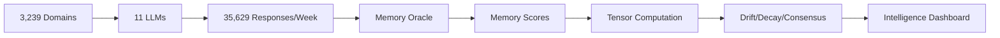

# 🧠 MASTER SPECIFICATION: AI BRAND INTELLIGENCE TRI-TENSOR SYSTEM

## Executive Summary

After 2 months of development, we have a sophisticated but operationally broken system. This document defines the complete vision, architecture, and implementation requirements for the AI Brand Intelligence platform that measures how LLMs perceive and remember brands over time.

## 🎯 Core Mission

**"We measure the shadows (LLM memory) so you can shape the light (public sentiment)"**

By tracking what AI systems remember, forget, and distort about brands, we create alpha for:
- Early brand positioning opportunities
- SEO/content arbitrage
- Policy and strategic planning
- Competitive intelligence

## 🔺 The Tri-Tensor Architecture

### 1. **MemoryTensor[Brand × LLM × MemoryScore × Time]**
- **What**: How strongly each LLM remembers each brand
- **Why Critical**: AI systems are becoming primary information sources
- **Computation**: Analyze LLM responses for brand recall, detail, accuracy
- **Decay Tracking**: Memory scores decrease over time without reinforcement

### 2. **SentimentTensor[Brand × Source × Sentiment × Time]** 
- **What**: Real-time public/media sentiment
- **Sources**: News, social media, forums, blogs
- **Purpose**: Ground truth of public perception

### 3. **GroundingTensor[Brand × Category × SignalType × Time]**
- **What**: Real-world events driving changes
- **Categories**: Regulatory, Financial, Product, Leadership
- **Purpose**: Causal understanding of shifts

## 📊 Why All 11 LLMs Must Fire Simultaneously

**Temporal Consistency**: All LLMs must be queried within the same time window to create valid tensors
- Different LLMs have different training cutoffs
- Retraining cycles vary by provider
- Memory decay rates differ

**Consensus Calculation**: 
```python
consensus_score = std_dev(llm_scores) / mean(llm_scores)
# Low variance = high consensus
# High variance = perception fragmentation
```

**Drift Detection**:
```python
drift_t = MemoryTensor[t] - MemoryTensor[t-1]
# Positive drift = gaining mindshare
# Negative drift = losing relevance
```

## 🔄 The Complete Data Pipeline



## 🚨 Current System Failures

1. **Missing Services**:
   - memory-oracle (tensor computation)
   - scheduler (weekly automation)
   - drift-detector (change analysis)

2. **Incomplete LLM Coverage**:
   - AI21 ❌ (no API key)
   - Perplexity ❌ (no API key)
   - XAI ❌ (no API key)

3. **No Automated Pipeline**:
   - Manual triggering required
   - No weekly scheduling
   - No failure recovery

## 📈 Memory Score Calculation

```python
def calculate_memory_score(response):
    score = 0
    
    # Brand mention frequency
    score += count_brand_mentions(response) * 10
    
    # Detail accuracy
    score += accuracy_score(response) * 20
    
    # Sentiment strength  
    score += abs(sentiment_score(response)) * 15
    
    # Recency awareness
    score += recency_score(response) * 25
    
    # Context richness
    score += context_depth(response) * 30
    
    return min(score, 100)
```

## 🔄 Decay Function

```python
def memory_decay(initial_score, days_elapsed):
    # Half-life of 30 days
    half_life = 30
    decay_rate = 0.693 / half_life
    return initial_score * exp(-decay_rate * days_elapsed)
```

## 🎯 Weekly Crawl Requirements

1. **Timing**: Every Sunday 00:00 UTC
2. **Parallelism**: 50 domains concurrent
3. **LLM Coordination**: All 11 must complete per domain
4. **Failure Handling**: Retry with alternate API keys
5. **Completion Target**: 6 hours for 3,239 domains

## 💡 The Alpha Generation

**Memory-Sentiment Divergence**:
```python
divergence = SentimentTensor[brand, t] - MemoryTensor[brand, t]

if divergence > threshold:
    # Public loves it, AI forgot it = OPPORTUNITY
    signal = "BUY_ATTENTION"
elif divergence < -threshold:
    # AI remembers, public forgot = RISK
    signal = "REPUTATION_RISK"
```

## 🏗️ Implementation Priorities

1. **Immediate** (This Week):
   - Fix missing LLM API keys
   - Deploy memory-oracle service
   - Implement weekly scheduler

2. **Short Term** (Next 2 Weeks):
   - Build tensor computation pipeline
   - Create drift detection algorithms
   - Implement consensus scoring

3. **Medium Term** (Month 1):
   - Dashboard for intelligence viewing
   - Alert system for major shifts
   - API for accessing tensors

## 🎯 Success Metrics

- All 11 LLMs firing successfully weekly
- 3,239 domains processed in <6 hours
- Memory scores computed for all responses
- Drift detection running continuously
- Consensus scores available per brand
- Weekly reports generated automatically

## 🔮 The Vision Realized

When fully operational, this system will:
1. Track how 11 major AI systems perceive 3,239 brands
2. Detect memory decay and perception shifts before humans notice
3. Identify arbitrage opportunities in the attention economy
4. Provide early warning for brand reputation risks
5. Create a new form of market intelligence based on AI cognition

---

**The core insight remains**: In an AI-driven world, what machines remember about your brand matters as much as what humans think. We're building the first system to systematically measure, track, and predict this machine memory at scale.