# Domain Runner Swarm Architecture Diagram

## System Overview Diagram

```mermaid
graph TB
    subgraph "External Interfaces"
        UI[llmpagerank.com<br/>Frontend]
        API[API Consumers<br/>Partners]
        CRON[Scheduler<br/>Weekly Triggers]
    end

    subgraph "Master Coordinator"
        MC[Master Swarm<br/>Orchestrator]
    end

    subgraph "Collection Swarm"
        CO[Collection<br/>Orchestrator]
        PHM[Provider Health<br/>Monitor]
        DV[Data<br/>Validator]
        RM[Retry<br/>Manager]
        BO[Batch<br/>Optimizer]
        
        CO --> PHM
        CO --> DV
        CO --> RM
        CO --> BO
    end

    subgraph "Intelligence Swarm"
        IO[Intelligence<br/>Orchestrator]
        MSC[Memory Score<br/>Calculator]
        DPA[Drift Pattern<br/>Analyzer]
        CA[Consensus<br/>Analyzer]
        CIA[Competitive<br/>Intelligence]
        TCE[Tensor<br/>Engine]
        
        IO --> MSC
        IO --> DPA
        IO --> CA
        IO --> CIA
        MSC --> TCE
        DPA --> TCE
        CA --> TCE
    end

    subgraph "API Swarm"
        AGM[API Gateway<br/>Manager]
        COA[Cache<br/>Optimizer]
        RF[Response<br/>Formatter]
        UAA[Usage<br/>Analytics]
        SLA[SLA<br/>Monitor]
        
        AGM --> COA
        AGM --> RF
        AGM --> UAA
        AGM --> SLA
    end

    subgraph "Security Swarm"
        SO[Security<br/>Orchestrator]
        AV[Access<br/>Validator]
        AD[Anomaly<br/>Detector]
        AL[Audit<br/>Logger]
        KLM[Key Lifecycle<br/>Manager]
        
        SO --> AV
        SO --> AD
        SO --> AL
        SO --> KLM
    end

    subgraph "Operations Swarm"
        SRO[Site Reliability<br/>Orchestrator]
        HM[Health<br/>Monitor]
        PA[Performance<br/>Analyzer]
        COP[Cost<br/>Optimizer]
        CP[Capacity<br/>Planner]
        
        SRO --> HM
        SRO --> PA
        SRO --> COP
        SRO --> CP
    end

    subgraph "Pipeline Swarm"
        PO[Pipeline<br/>Orchestrator]
        BM[Batch<br/>Manager]
        WC[Worker<br/>Coordinator]
        RO[Resource<br/>Optimizer]
        
        PO --> BM
        PO --> WC
        PO --> RO
    end

    subgraph "Data Layer"
        DB[(PostgreSQL<br/>Database)]
        REDIS[(Redis<br/>Cache/PubSub)]
        
        subgraph "Core Tables"
            DT[domains]
            DRT[domain_responses]
            VST[volatility_scores]
            PAK[partner_api_keys]
        end
    end

    subgraph "LLM Providers"
        OAI[OpenAI]
        ANT[Anthropic]
        DS[DeepSeek]
        MIS[Mistral]
        XAI[xAI]
        TOG[Together]
        PER[Perplexity]
        GOO[Google]
        COH[Cohere]
        A21[AI21]
        GRO[Groq]
    end

    %% Master Coordination
    CRON --> MC
    MC --> CO
    MC --> IO
    MC --> AGM
    MC --> SO
    MC --> SRO
    MC --> PO

    %% Data Flow
    CO --> DB
    DB --> IO
    IO --> DB
    DB --> AGM
    API --> AGM
    UI --> AGM

    %% Collection Flow
    CO --> OAI
    CO --> ANT
    CO --> DS
    CO --> MIS
    CO --> XAI
    CO --> TOG
    CO --> PER
    CO --> GOO
    CO --> COH
    CO --> A21
    CO --> GRO

    %% Inter-Swarm Communication
    CO -.->|data.collection.complete| REDIS
    IO -.->|intelligence.insight.generated| REDIS
    AGM -.->|api.request.received| REDIS
    SO -.->|security.threat.detected| REDIS
    SRO -.->|operations.alert.raised| REDIS
    PO -.->|pipeline.batch.processed| REDIS

    %% Security Monitoring
    SO -.-> CO
    SO -.-> IO
    SO -.-> AGM
    SO -.-> PO

    %% Operations Monitoring
    SRO -.-> CO
    SRO -.-> IO
    SRO -.-> AGM
    SRO -.-> PO

    classDef swarmLead fill:#f96,stroke:#333,stroke-width:4px
    classDef agent fill:#bbf,stroke:#333,stroke-width:2px
    classDef external fill:#fdb,stroke:#333,stroke-width:2px
    classDef data fill:#dfd,stroke:#333,stroke-width:2px
    classDef provider fill:#ffd,stroke:#333,stroke-width:2px

    class MC,CO,IO,AGM,SO,SRO,PO swarmLead
    class PHM,DV,RM,BO,MSC,DPA,CA,CIA,TCE,COA,RF,UAA,SLA,AV,AD,AL,KLM,HM,PA,COP,CP,BM,WC,RO agent
    class UI,API,CRON external
    class DB,REDIS,DT,DRT,VST,PAK data
    class OAI,ANT,DS,MIS,XAI,TOG,PER,GOO,COH,A21,GRO provider
```

## Data Flow Sequence Diagram

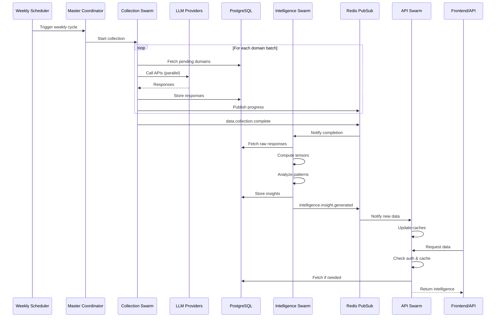

## Swarm Topology Diagrams

### Collection Swarm (Hierarchical)
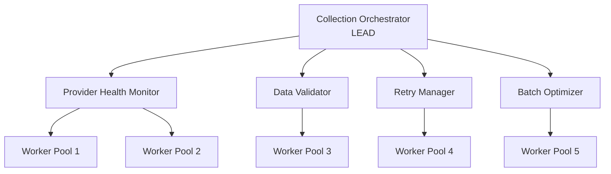

### Intelligence Swarm (Mesh)
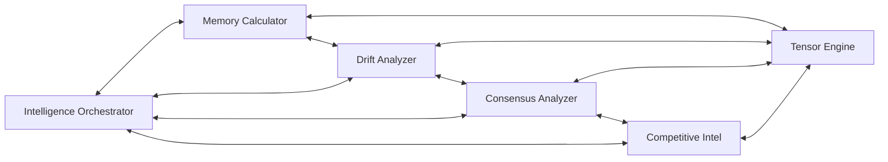

### API Swarm (Star)
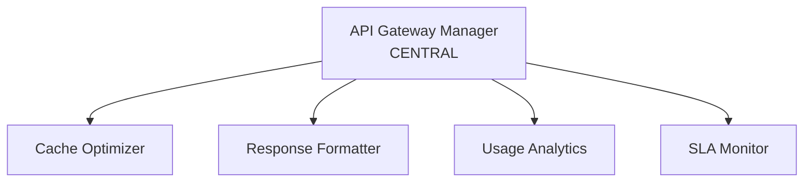

### Security Swarm (Ring)
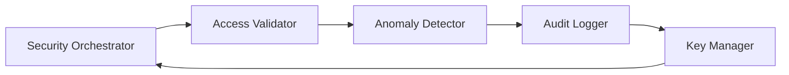

## Tensor Computation Structure

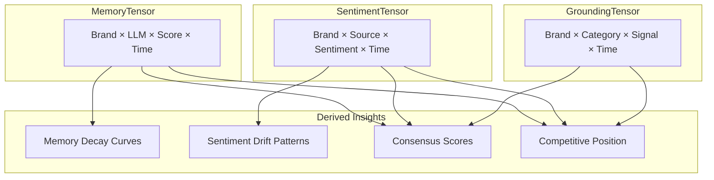

## State Machine Diagrams

### Domain Processing State Machine
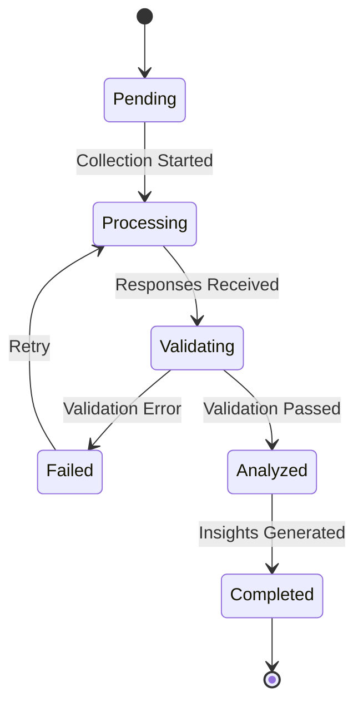

### Swarm Lifecycle State Machine
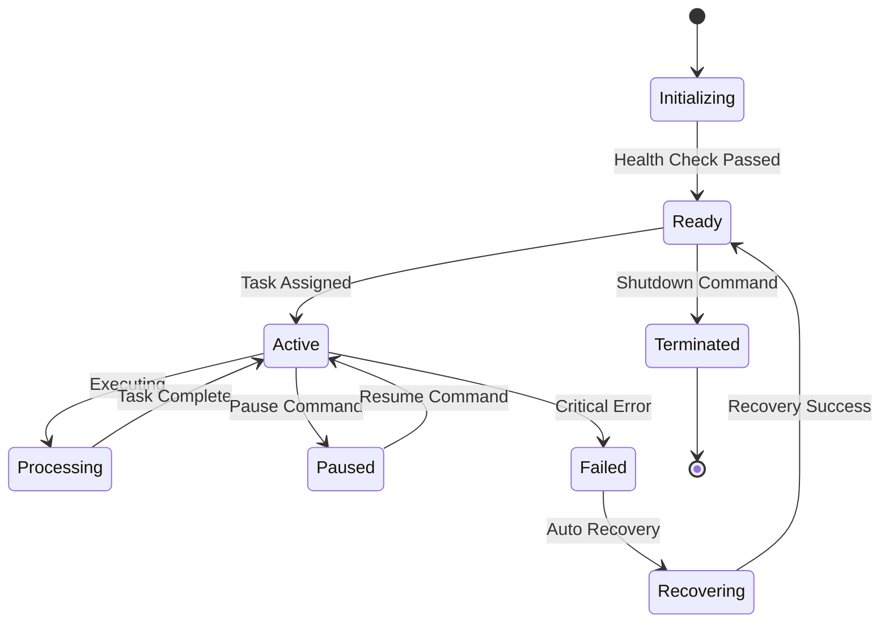

## Resource Allocation Diagram

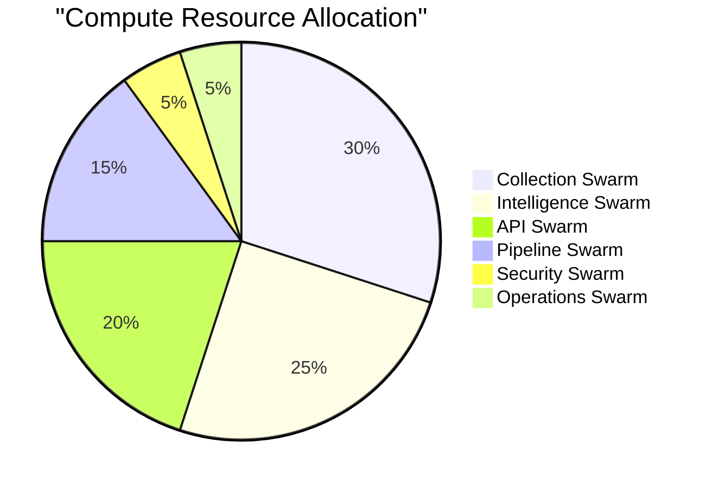

## Performance Metrics Dashboard Layout

```
┌─────────────────────────────────────────────────────────────┐
│                    DOMAIN RUNNER SWARM DASHBOARD             │
├─────────────────────┬───────────────────┬───────────────────┤
│ Collection Status   │ Intelligence Status│ API Performance   │
│ ┌─────────────────┐ │ ┌─────────────────┐│ ┌─────────────────┐│
│ │Domains: 3239/3239│ │ │Tensors: Updated ││ │Requests: 1.2M/d ││
│ │Progress: 100%    │ │ │Insights: 847    ││ │Latency: 87ms    ││
│ │Speed: 1247/hr   │ │ │Alerts: 12       ││ │Cache Hit: 94.2% ││
│ └─────────────────┘ │ └─────────────────┘│ └─────────────────┘│
├─────────────────────┴───────────────────┴───────────────────┤
│                        Swarm Health                          │
│ Collection: ●  Intelligence: ●  API: ●  Security: ●         │
│ Operations: ●  Pipeline: ●                                   │
├─────────────────────────────────────────────────────────────┤
│                    Active Alerts                             │
│ ⚠️  High memory usage in Collection Swarm (87%)              │
│ ⚠️  Drift detected: Tesla brand perception shift             │
│ ✅ All systems operational                                   │
└─────────────────────────────────────────────────────────────┘

Legend: ● Healthy  ● Warning  ● Critical
```

## Cost Analysis by Swarm

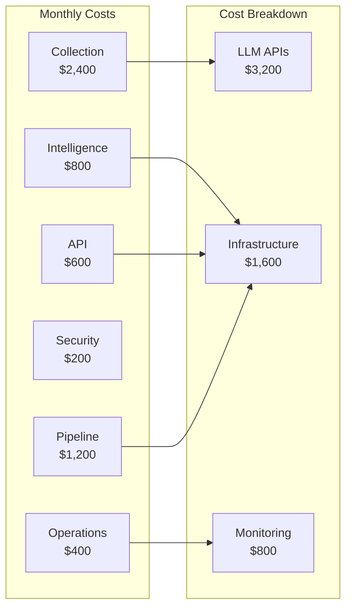

## Scale Progression

```
Week 1:  [■□□□□□□□□□] 10%  - Single swarm operational
Week 2:  [■■■□□□□□□□] 30%  - Collection + Intelligence
Week 3:  [■■■■■□□□□□] 50%  - Add API + Security
Week 4:  [■■■■■■■□□□] 70%  - Add Operations + Pipeline
Week 5:  [■■■■■■■■■□] 90%  - Inter-swarm coordination
Week 6:  [■■■■■■■■■■] 100% - Full system operational

Target Metrics:
- 10,000 domains/week capacity
- 50+ LLM models
- <50ms API response
- 99.99% uptime
```

This comprehensive diagram specification provides visual representation of:
1. Overall system architecture
2. Data flow sequences
3. Individual swarm topologies
4. State machines for key processes
5. Resource allocation
6. Performance dashboards
7. Cost analysis
8. Scaling progression

Each diagram can be rendered using Mermaid in documentation tools or converted to high-quality images for presentations.