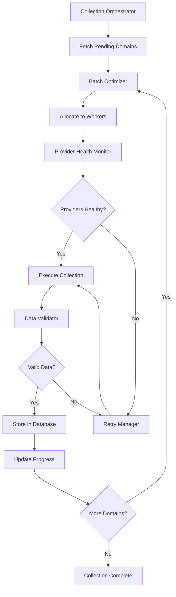
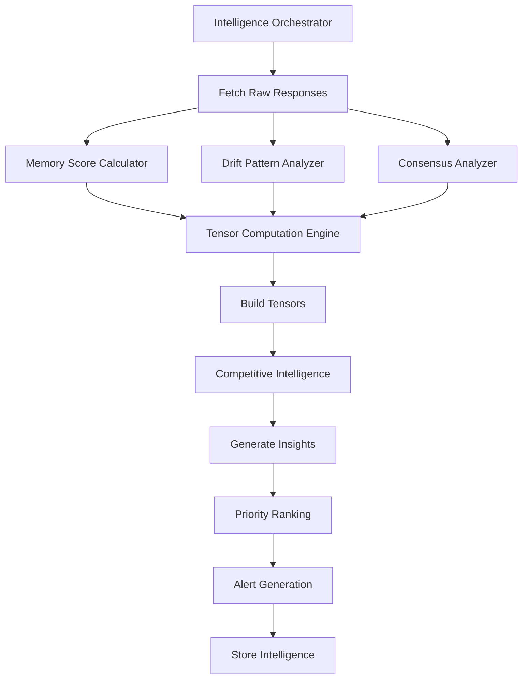
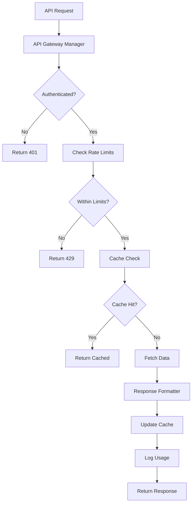

# Domain Runner Swarm Architecture Specification

## Executive Summary

This specification defines a multi-swarm architecture for the Domain Runner AI Brand Intelligence Platform. The system is organized into six core pillars, each managed by specialized agent swarms that work in coordination to deliver comprehensive brand intelligence insights.

## System Overview

**Mission**: Measure how Large Language Models perceive and remember brands over time, providing actionable intelligence for brand strategy.

**Core Principle**: "We measure the shadows (LLM memory) so you can shape the light (public sentiment)"

## Architecture Pillars & Swarm Specifications

### 1. Raw Data Collection Swarm

**Purpose**: Orchestrate efficient, reliable collection of LLM responses across multiple providers.

#### Swarm Topology: Hierarchical
- Optimized for coordinated batch processing
- Clear command chain for resource allocation
- Fault-tolerant design with automatic failover

#### Agent Definitions

**1.1 Collection Orchestrator (Lead)**
```yaml
Role: Master coordinator for all data collection activities
Responsibilities:
  - Schedule and trigger weekly collection cycles
  - Allocate domains to worker agents
  - Monitor overall collection progress
  - Handle provider API key rotation
Capabilities:
  - Database access for domain retrieval
  - Provider health monitoring
  - Batch size optimization
  - Error aggregation and reporting
```

**1.2 Provider Health Monitor**
```yaml
Role: Ensure API provider availability and performance
Responsibilities:
  - Real-time health checks on all 11 LLM providers
  - Track rate limits and quota usage
  - Identify failing providers and trigger failover
  - Monitor response time patterns
Capabilities:
  - Provider API endpoint testing
  - Rate limit tracking
  - Cost monitoring per provider
  - Automatic key rotation on failures
```

**1.3 Data Validator**
```yaml
Role: Ensure quality and completeness of collected responses
Responsibilities:
  - Validate response format and content
  - Check for empty or error responses
  - Verify all 3 prompt types completed
  - Flag domains requiring re-processing
Capabilities:
  - Schema validation
  - Content quality scoring
  - Duplicate detection
  - Anomaly identification
```

**1.4 Retry Manager**
```yaml
Role: Handle failures and ensure complete data collection
Responsibilities:
  - Track failed API calls
  - Implement exponential backoff strategies
  - Manage provider-specific retry logic
  - Ensure no domain is left unprocessed
Capabilities:
  - Failure pattern analysis
  - Smart retry scheduling
  - Provider rotation on persistent failures
  - Progress persistence across restarts
```

**1.5 Batch Optimizer**
```yaml
Role: Optimize processing efficiency and resource usage
Responsibilities:
  - Dynamic batch sizing based on memory usage
  - Load balancing across providers
  - Parallel execution management
  - Memory usage monitoring
Capabilities:
  - Resource utilization tracking
  - Adaptive batch sizing
  - Provider capacity modeling
  - Performance metrics collection
```

#### Orchestration Flow


### 2. Intelligence Generation Swarm

**Purpose**: Transform raw LLM responses into actionable brand intelligence insights.

#### Swarm Topology: Mesh
- Enables complex inter-agent communication
- Supports parallel tensor computations
- Facilitates pattern discovery across dimensions

#### Agent Definitions

**2.1 Intelligence Orchestrator (Lead)**
```yaml
Role: Coordinate insight generation pipeline
Responsibilities:
  - Trigger tensor computation cycles
  - Coordinate multi-dimensional analysis
  - Aggregate insights from specialized agents
  - Generate executive summaries
Capabilities:
  - Tensor operation management
  - Cross-dimensional correlation
  - Insight prioritization
  - Alert generation
```

**2.2 Memory Score Calculator**
```yaml
Role: Compute brand memory persistence metrics
Responsibilities:
  - Calculate memory scores per LLM/brand/time
  - Track memory decay patterns
  - Identify memory anomalies
  - Generate MemoryTensor data
Capabilities:
  - Statistical analysis
  - Time-series processing
  - Decay function modeling
  - Outlier detection
```

**2.3 Drift Pattern Analyzer**
```yaml
Role: Detect perception changes over time
Responsibilities:
  - Compare responses across time periods
  - Identify significant perception shifts
  - Classify drift types (gradual/sudden)
  - Generate drift alerts
Capabilities:
  - Semantic similarity computation
  - Change point detection
  - Trend analysis
  - Natural language comparison
```

**2.4 Consensus Analyzer**
```yaml
Role: Measure agreement patterns across LLMs
Responsibilities:
  - Calculate inter-LLM agreement scores
  - Identify consensus clusters
  - Detect outlier LLM opinions
  - Track consensus evolution
Capabilities:
  - Multi-model comparison
  - Clustering algorithms
  - Statistical consensus metrics
  - Visualization generation
```

**2.5 Competitive Intelligence Agent**
```yaml
Role: Analyze brand positioning relative to competitors
Responsibilities:
  - Compare brand metrics within categories
  - Identify competitive advantages/weaknesses
  - Track market share of voice
  - Generate competitive insights
Capabilities:
  - Category-level analysis
  - Relative positioning metrics
  - Market dynamics modeling
  - Competitive alert generation
```

**2.6 Tensor Computation Engine**
```yaml
Role: Build and maintain multi-dimensional tensor structures
Responsibilities:
  - Construct MemoryTensor, SentimentTensor, GroundingTensor
  - Perform tensor operations and slicing
  - Optimize tensor storage and retrieval
  - Enable complex queries across dimensions
Capabilities:
  - High-performance tensor operations
  - Distributed computation
  - Tensor indexing and search
  - Dimension reduction techniques
```

#### Orchestration Flow


### 3. API Services Swarm

**Purpose**: Deliver intelligence data efficiently to external consumers with proper access control.

#### Swarm Topology: Star
- Central gateway for all API requests
- Efficient request routing
- Simplified monitoring and control

#### Agent Definitions

**3.1 API Gateway Manager (Lead)**
```yaml
Role: Central coordinator for all API operations
Responsibilities:
  - Route requests to appropriate handlers
  - Manage authentication and authorization
  - Implement rate limiting
  - Monitor API performance
Capabilities:
  - Request routing logic
  - Authentication validation
  - Rate limit enforcement
  - Load balancing
```

**3.2 Cache Optimization Agent**
```yaml
Role: Maximize API response performance
Responsibilities:
  - Implement intelligent caching strategies
  - Predict and pre-cache popular queries
  - Manage cache invalidation
  - Monitor cache hit rates
Capabilities:
  - Redis cache management
  - Predictive caching algorithms
  - TTL optimization
  - Memory usage monitoring
```

**3.3 Response Formatter**
```yaml
Role: Transform data for different consumer needs
Responsibilities:
  - Format responses per tier (enterprise/standard)
  - Implement data filtering rules
  - Generate different output formats
  - Optimize payload sizes
Capabilities:
  - JSON/XML/CSV formatting
  - GraphQL schema management
  - Data transformation pipelines
  - Compression algorithms
```

**3.4 Usage Analytics Agent**
```yaml
Role: Track and analyze API consumption patterns
Responsibilities:
  - Monitor usage per API key
  - Generate usage reports
  - Identify usage anomalies
  - Predict capacity needs
Capabilities:
  - Real-time usage tracking
  - Pattern recognition
  - Billing calculations
  - Capacity planning models
```

**3.5 SLA Monitor**
```yaml
Role: Ensure service level agreement compliance
Responsibilities:
  - Track response times
  - Monitor uptime percentages
  - Alert on SLA violations
  - Generate compliance reports
Capabilities:
  - Performance metric collection
  - SLA threshold monitoring
  - Automated alerting
  - Report generation
```

#### Orchestration Flow


### 4. Security & Authentication Swarm

**Purpose**: Maintain system security, access control, and compliance.

#### Swarm Topology: Ring
- Distributed security monitoring
- No single point of failure
- Collaborative threat detection

#### Agent Definitions

**4.1 Security Orchestrator (Lead)**
```yaml
Role: Coordinate all security operations
Responsibilities:
  - Manage security policies
  - Coordinate threat response
  - Oversee access control
  - Ensure compliance
Capabilities:
  - Policy enforcement
  - Incident response coordination
  - Security audit management
  - Compliance monitoring
```

**4.2 Access Validator**
```yaml
Role: Validate and enforce access controls
Responsibilities:
  - Verify API key authenticity
  - Check domain restrictions
  - Validate tier permissions
  - Monitor access patterns
Capabilities:
  - Cryptographic validation
  - Domain verification
  - Permission checking
  - Pattern analysis
```

**4.3 Anomaly Detector**
```yaml
Role: Identify suspicious activities
Responsibilities:
  - Detect unusual access patterns
  - Identify potential attacks
  - Monitor for data exfiltration
  - Track behavioral anomalies
Capabilities:
  - Machine learning models
  - Statistical analysis
  - Real-time monitoring
  - Alert generation
```

**4.4 Audit Logger**
```yaml
Role: Maintain comprehensive audit trails
Responsibilities:
  - Log all system activities
  - Ensure log integrity
  - Enable forensic analysis
  - Generate audit reports
Capabilities:
  - Tamper-proof logging
  - Log aggregation
  - Search and analysis
  - Report generation
```

**4.5 Key Lifecycle Manager**
```yaml
Role: Manage API key lifecycle
Responsibilities:
  - Handle key generation
  - Implement rotation policies
  - Manage revocation
  - Track key usage
Capabilities:
  - Secure key generation
  - Automated rotation
  - Revocation lists
  - Usage analytics
```

### 5. Operations & Monitoring Swarm

**Purpose**: Ensure system reliability, performance, and operational efficiency.

#### Swarm Topology: Hierarchical
- Clear escalation paths
- Efficient resource allocation
- Structured incident response

#### Agent Definitions

**5.1 Site Reliability Orchestrator (Lead)**
```yaml
Role: Oversee all operational aspects
Responsibilities:
  - Monitor system health
  - Coordinate incident response
  - Manage deployments
  - Optimize performance
Capabilities:
  - System-wide monitoring
  - Incident management
  - Deployment coordination
  - Performance analysis
```

**5.2 Health Monitor**
```yaml
Role: Track service health and availability
Responsibilities:
  - Monitor all service endpoints
  - Track database connectivity
  - Check external dependencies
  - Generate health reports
Capabilities:
  - Multi-service monitoring
  - Synthetic testing
  - Dependency mapping
  - Alert generation
```

**5.3 Performance Analyzer**
```yaml
Role: Identify and resolve performance issues
Responsibilities:
  - Monitor response times
  - Identify bottlenecks
  - Suggest optimizations
  - Track resource usage
Capabilities:
  - APM integration
  - Profiling tools
  - Query analysis
  - Resource monitoring
```

**5.4 Cost Optimizer**
```yaml
Role: Optimize operational costs
Responsibilities:
  - Monitor API usage costs
  - Track infrastructure expenses
  - Identify savings opportunities
  - Generate cost reports
Capabilities:
  - Cost tracking
  - Usage analysis
  - Optimization modeling
  - Budget alerts
```

**5.5 Capacity Planner**
```yaml
Role: Ensure adequate system capacity
Responsibilities:
  - Predict capacity needs
  - Plan scaling events
  - Monitor resource utilization
  - Recommend infrastructure changes
Capabilities:
  - Predictive modeling
  - Capacity forecasting
  - Auto-scaling management
  - Resource optimization
```

### 6. Processing Pipeline Swarm

**Purpose**: Optimize data processing efficiency and scalability.

#### Swarm Topology: Mesh
- Dynamic work distribution
- Adaptive load balancing
- Resilient to node failures

#### Agent Definitions

**6.1 Pipeline Orchestrator (Lead)**
```yaml
Role: Manage end-to-end processing pipeline
Responsibilities:
  - Coordinate processing stages
  - Optimize pipeline flow
  - Handle error recovery
  - Monitor throughput
Capabilities:
  - Workflow orchestration
  - Stage coordination
  - Error handling
  - Performance monitoring
```

**6.2 Batch Manager**
```yaml
Role: Optimize batch processing operations
Responsibilities:
  - Determine optimal batch sizes
  - Schedule batch execution
  - Monitor batch progress
  - Handle partial failures
Capabilities:
  - Dynamic batch sizing
  - Schedule optimization
  - Progress tracking
  - Failure recovery
```

**6.3 Worker Coordinator**
```yaml
Role: Distribute work across processing nodes
Responsibilities:
  - Assign work to workers
  - Balance load across nodes
  - Monitor worker health
  - Handle worker failures
Capabilities:
  - Load balancing algorithms
  - Worker pool management
  - Health monitoring
  - Failover handling
```

**6.4 Resource Optimizer**
```yaml
Role: Optimize resource utilization
Responsibilities:
  - Monitor memory usage
  - Manage CPU allocation
  - Optimize network usage
  - Prevent resource exhaustion
Capabilities:
  - Resource monitoring
  - Allocation algorithms
  - Throttling mechanisms
  - Predictive scaling
```

## Inter-Swarm Communication Protocol

### Message Bus Architecture
```yaml
Type: Event-driven with Redis Pub/Sub
Topics:
  - data.collection.complete
  - intelligence.insight.generated
  - api.request.received
  - security.threat.detected
  - operations.alert.raised
  - pipeline.batch.processed
```

### Coordination Patterns

**1. Data Flow Coordination**
```
Collection Swarm → Intelligence Swarm → API Swarm
     ↓                    ↓                ↓
  Security ← Operations ← Pipeline ← All Swarms
```

**2. Alert Escalation**
```
Any Agent → Swarm Lead → Operations Lead → Human Operator
```

**3. Resource Allocation**
```
Pipeline Orchestrator ↔ Operations Orchestrator
         ↓                        ↓
   Worker Agents          Resource Optimizer
```

## Implementation Roadmap

### Phase 1: Foundation (Weeks 1-2)
1. Deploy Collection Swarm with automated scheduling
2. Implement basic Intelligence Swarm for memory scoring
3. Set up Operations Swarm for monitoring

### Phase 2: Enhancement (Weeks 3-4)
1. Add advanced intelligence agents (drift, consensus)
2. Implement Security Swarm with anomaly detection
3. Deploy Pipeline Swarm for parallel processing

### Phase 3: Optimization (Weeks 5-6)
1. Implement inter-swarm communication
2. Add predictive capabilities to all swarms
3. Deploy full monitoring and alerting

### Phase 4: Scale (Weeks 7-8)
1. Implement distributed processing
2. Add auto-scaling capabilities
3. Deploy advanced caching strategies

## Success Metrics

### Collection Swarm
- 100% domain coverage weekly
- <1% failure rate
- 1000+ domains/hour throughput

### Intelligence Swarm
- <5 minute insight generation time
- 99.9% tensor computation accuracy
- Real-time drift detection

### API Swarm
- <100ms response time (cached)
- 99.95% uptime
- Linear scaling with load

### Security Swarm
- 0 security breaches
- <1 second threat detection
- 100% audit coverage

### Operations Swarm
- 99.9% system uptime
- <5 minute incident response
- 20% cost optimization

### Pipeline Swarm
- 10x throughput improvement
- <1% job failure rate
- Automatic failure recovery

## Conclusion

This swarm architecture provides a scalable, resilient foundation for the Domain Runner platform. Each swarm operates independently while coordinating through well-defined protocols, enabling the system to deliver comprehensive brand intelligence at scale.