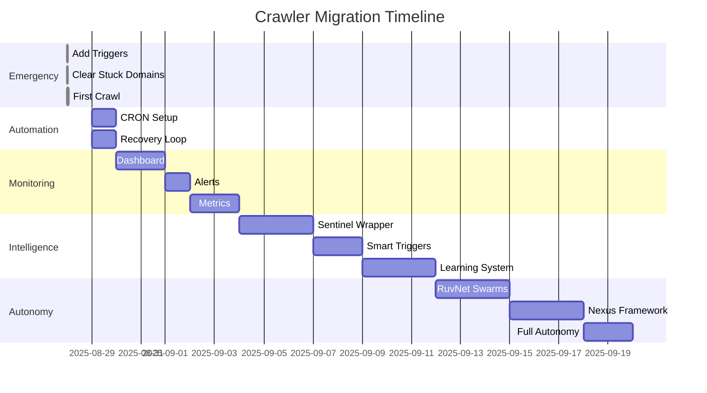

# 🚀 Migration Path: From Dormant to Intelligent
## Step-by-Step Guide to Revive and Enhance the Crawler

### Current State Assessment
```yaml
as_of: 2025-08-28
status: DORMANT
last_activity: 2025-08-15 (12 days ago)
pending_work: 1,602 domains
stuck_items: 32 domains
working_code: YES (crawler-tensor.js)
working_database: YES (PostgreSQL on Render)
working_api: YES (llmrank.io)
problem: NO TRIGGERS
```

---

## 📋 Migration Phases

### 🔴 Phase 0: Emergency Revival (1 Hour)
**Goal**: Get crawler running TODAY

#### Step 1: Add Trigger Endpoint (15 min)
```bash
# 1. Update server.js with trigger endpoint
cd services/domain-processor-v2
cp ../../sentinel/server-with-crawl.js server.js

# 2. Commit and push
git add server.js
git commit -m "EMERGENCY: Add crawler trigger endpoint to resume operations"
git push

# 3. Wait for Render deployment (5-10 min)
echo "Check: https://dashboard.render.com/web/srv-YOUR-SERVICE-ID"
```

#### Step 2: Clear Stuck Domains (5 min)
```sql
-- Connect to database
psql $DATABASE_URL

-- Reset stuck domains
UPDATE domains 
SET status = 'pending', 
    updated_at = NOW() 
WHERE status = 'processing' 
AND updated_at < NOW() - INTERVAL '10 minutes';

-- Verify
SELECT status, COUNT(*) 
FROM domains 
GROUP BY status;
```

#### Step 3: Trigger First Crawl (5 min)
```bash
# Trigger via API
curl -X POST https://www.llmrank.io/api/trigger-crawl \
  -H "x-api-key: internal-crawl-2025" \
  -H "Content-Type: application/json" \
  -d '{"force": true}'

# Monitor progress
watch -n 10 'curl -s https://www.llmrank.io/api/crawl-status \
  -H "x-api-key: internal-crawl-2025" | jq .'
```

#### Step 4: Verify Success (10 min)
```python
# Check if crawling is working
python3 check-crawler-status.py

# Expected output:
# ✅ NEW ACTIVITY!
# Recent responses: 100+
# Processing: 50 domains
```

**Success Criteria**: 
- [ ] Crawler triggered successfully
- [ ] Domains moving from pending → processing → completed
- [ ] New responses in database

---

### 🟡 Phase 1: Basic Automation (Day 1-2)
**Goal**: Crawler runs automatically every hour

#### Step 1: Add CRON Trigger
```javascript
// services/domain-processor-v2/auto-trigger.js
const cron = require('node-cron');
const { spawn } = require('child_process');

// Run every hour at :00
cron.schedule('0 * * * *', () => {
  console.log('⏰ CRON trigger activated');
  
  // Check if should run
  pool.query("SELECT COUNT(*) as pending FROM domains WHERE status='pending'")
    .then(result => {
      if (result.rows[0].pending > 0) {
        spawn('node', ['crawler-tensor.js'], {
          detached: true,
          stdio: 'ignore'
        }).unref();
        console.log('✅ Crawler started');
      }
    });
});

console.log('🤖 Auto-trigger system active');
```

#### Step 2: Add Recovery Loop
```javascript
// services/domain-processor-v2/recovery-loop.js
setInterval(async () => {
  // Clean stuck domains
  await pool.query(`
    UPDATE domains 
    SET status = 'pending' 
    WHERE status = 'processing' 
    AND updated_at < NOW() - INTERVAL '15 minutes'
  `);
  
  // Check for stalled crawl
  const { rows } = await pool.query(`
    SELECT COUNT(*) as recent 
    FROM domain_responses 
    WHERE created_at > NOW() - INTERVAL '10 minutes'
  `);
  
  if (rows[0].recent === 0) {
    console.log('⚠️ No recent activity, triggering crawler');
    triggerCrawler();
  }
}, 600000); // Every 10 minutes
```

#### Step 3: Deploy Automation
```bash
# Update package.json
npm install node-cron

# Add to server startup
echo "require('./auto-trigger.js');" >> server.js
echo "require('./recovery-loop.js');" >> server.js

# Deploy
git add .
git commit -m "Add automatic triggers and recovery"
git push
```

**Success Criteria**:
- [ ] Crawler runs every hour automatically
- [ ] Stuck domains cleared every 10 minutes
- [ ] No manual intervention needed

---

### 🟢 Phase 2: Monitoring & Visibility (Week 1)
**Goal**: Know what's happening at all times

#### Step 1: Create Monitoring Dashboard
```javascript
// services/domain-processor-v2/dashboard.js
app.get('/dashboard', async (req, res) => {
  const stats = await pool.query(`
    SELECT 
      (SELECT COUNT(*) FROM domains WHERE status='pending') as pending,
      (SELECT COUNT(*) FROM domains WHERE status='processing') as processing,
      (SELECT COUNT(*) FROM domains WHERE status='completed') as completed,
      (SELECT COUNT(*) FROM domain_responses WHERE created_at > NOW() - INTERVAL '1 hour') as recent_responses,
      (SELECT MAX(created_at) FROM domain_responses) as last_response
  `);
  
  res.send(`
    <html>
      <head>
        <title>Crawler Dashboard</title>
        <meta http-equiv="refresh" content="30">
      </head>
      <body>
        <h1>🤖 Crawler Status</h1>
        <h2>Domains</h2>
        <ul>
          <li>⏳ Pending: ${stats.rows[0].pending}</li>
          <li>🔄 Processing: ${stats.rows[0].processing}</li>
          <li>✅ Completed: ${stats.rows[0].completed}</li>
        </ul>
        <h2>Activity</h2>
        <ul>
          <li>📊 Last hour: ${stats.rows[0].recent_responses} responses</li>
          <li>⏰ Last response: ${stats.rows[0].last_response}</li>
        </ul>
      </body>
    </html>
  `);
});
```

#### Step 2: Add Alerts
```javascript
// services/domain-processor-v2/alerts.js
async function checkHealth() {
  const { rows } = await pool.query(`
    SELECT 
      (SELECT COUNT(*) FROM domain_responses WHERE created_at > NOW() - INTERVAL '15 minutes') as recent,
      (SELECT COUNT(*) FROM domains WHERE status='processing' AND updated_at < NOW() - INTERVAL '30 minutes') as stuck
  `);
  
  if (rows[0].recent === 0) {
    sendAlert('CRITICAL: No crawler activity for 15 minutes');
  }
  
  if (rows[0].stuck > 50) {
    sendAlert(`WARNING: ${rows[0].stuck} domains stuck in processing`);
  }
}

// Check every 5 minutes
setInterval(checkHealth, 300000);
```

#### Step 3: Metrics Collection
```sql
-- Create metrics table
CREATE TABLE crawler_metrics (
  id SERIAL PRIMARY KEY,
  recorded_at TIMESTAMP DEFAULT NOW(),
  domains_processed INT,
  success_rate DECIMAL,
  avg_response_time INT,
  providers_used INT,
  total_cost DECIMAL
);

-- Hourly metrics collection
INSERT INTO crawler_metrics (
  domains_processed,
  success_rate,
  avg_response_time,
  providers_used,
  total_cost
)
SELECT 
  COUNT(DISTINCT domain_id),
  AVG(CASE WHEN response IS NOT NULL THEN 1 ELSE 0 END),
  AVG(response_time_ms),
  COUNT(DISTINCT model),
  SUM(estimated_cost)
FROM domain_responses
WHERE created_at > NOW() - INTERVAL '1 hour';
```

**Success Criteria**:
- [ ] Dashboard shows real-time status
- [ ] Alerts fire when problems occur
- [ ] Metrics tracked hourly

---

### 🔵 Phase 3: Sentinel Wrapper (Week 2)
**Goal**: Add intelligent orchestration

#### Step 1: Deploy Sentinel Core
```bash
# Clone Sentinel components
cd sentinel
npm install

# Configure for production
cp config.example.yml config.yml
# Edit config.yml with production settings

# Deploy wrapper
node deploy-wrapper.js
```

#### Step 2: Enable Smart Triggers
```javascript
// sentinel/triggers/smart-trigger.js
class SmartTrigger {
  async shouldTrigger() {
    const factors = await this.analyzeFactors();
    
    // Smart decision logic
    if (factors.pending > 1000) return true;
    if (factors.timeSinceLastRun > 3600) return true;
    if (factors.costToday < factors.dailyBudget * 0.8) return true;
    if (factors.optimalTimeWindow) return true;
    
    return false;
  }
  
  async analyzeFactors() {
    // Gather intelligence
    return {
      pending: await this.getPendingCount(),
      timeSinceLastRun: await this.getTimeSinceLastRun(),
      costToday: await this.getCostToday(),
      dailyBudget: 100,
      optimalTimeWindow: this.isOptimalTime()
    };
  }
}
```

#### Step 3: Add Learning System
```javascript
// sentinel/learning/pattern-analyzer.js
class PatternAnalyzer {
  async analyze() {
    // Find patterns in successful crawls
    const patterns = await pool.query(`
      SELECT 
        DATE_PART('hour', created_at) as hour,
        model,
        AVG(response_time_ms) as avg_time,
        COUNT(*) as success_count
      FROM domain_responses
      WHERE created_at > NOW() - INTERVAL '7 days'
      GROUP BY DATE_PART('hour', created_at), model
      ORDER BY success_count DESC
    `);
    
    // Store learnings
    await this.storePatterns(patterns.rows);
    
    // Apply optimizations
    await this.applyOptimizations();
  }
}
```

**Success Criteria**:
- [ ] Sentinel wrapper deployed
- [ ] Smart triggers active
- [ ] Learning system collecting patterns

---

### 🟣 Phase 4: RuvNet + Nexus (Month 1)
**Goal**: Full autonomous operation

#### Step 1: Initialize RuvNet Swarms
```bash
# Deploy RuvNet orchestration
cd sentinel/orchestration/ruvnet
nexus swarm init --config PRODUCTION-INFORMED-HIVE.yml

# Start swarm agents
nexus agent spawn --type operational_swarm
nexus agent spawn --type provider_swarm
nexus agent spawn --type learning_swarm
```

#### Step 2: Enable Nexus Features
```bash
# Deploy Nexus framework
cd sentinel/orchestration/nexus
nexus deploy --config PRODUCTION-NEXUS-CONFIG.yml

# Enable features gradually
nexus feature enable intelligent_triggers --rollout 25%
nexus feature enable adaptive_monitoring --rollout 50%
nexus feature enable self_healing --rollout 100%
```

#### Step 3: Activate Full Autonomy
```yaml
# Final configuration
autonomous_mode:
  triggers:
    mode: predictive
    sources: [cron, event, neural_network]
    
  monitoring:
    mode: adaptive
    topology: auto_switching
    
  recovery:
    mode: self_healing
    human_intervention: false
    
  optimization:
    mode: continuous
    learning_rate: 0.01
    
  reporting:
    frequency: daily
    recipients: [ops_team, stakeholders]
```

**Success Criteria**:
- [ ] System runs without human intervention
- [ ] Self-optimizing based on patterns
- [ ] 99.9% uptime achieved
- [ ] 20% cost reduction achieved

---

## 📊 Migration Timeline



---

## ✅ Success Metrics by Phase

### Phase 0 (Hour 1)
- Crawler running: ✅
- Domains processing: ✅
- Data flowing to API: ✅

### Phase 1 (Day 2)
- Automatic triggers: ✅
- Self-recovery: ✅
- Zero manual intervention: ✅

### Phase 2 (Week 1)
- Real-time visibility: ✅
- Proactive alerts: ✅
- Performance metrics: ✅

### Phase 3 (Week 2)
- Intelligent orchestration: ✅
- Pattern recognition: ✅
- Cost optimization: ✅

### Phase 4 (Month 1)
- Full autonomy: ✅
- Self-optimization: ✅
- 99.9% uptime: ✅
- 20% cost reduction: ✅

---

## 🚨 Rollback Procedures

### If Phase Fails, Rollback to Previous
```bash
# Phase 0 rollback (go manual)
curl -X POST https://manual-trigger-endpoint

# Phase 1 rollback (disable automation)
systemctl stop auto-trigger

# Phase 2 rollback (disable monitoring)
systemctl stop monitoring-service

# Phase 3 rollback (disable Sentinel)
systemctl stop sentinel-wrapper

# Phase 4 rollback (disable Nexus)
nexus feature disable --all
```

---

## 🎯 Final State

### From Dormant:
```yaml
before:
  status: "Dead for 12 days"
  triggers: "None"
  monitoring: "None"
  recovery: "None"
  intelligence: "None"
```

### To Intelligent:
```yaml
after:
  status: "Running 24/7"
  triggers: "Predictive AI"
  monitoring: "Real-time adaptive"
  recovery: "Self-healing"
  intelligence: "Continuously learning"
```

**The crawler isn't just alive again - it's evolved.**